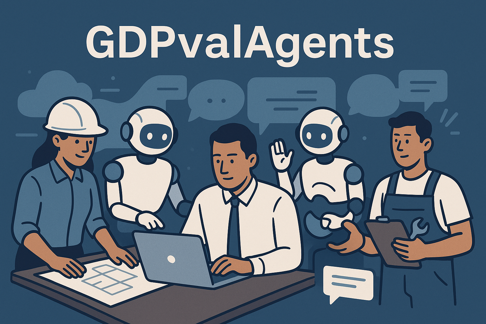

# GDPValAgents

This project represents experiments to create agents capable of carrying out tasks with economic value.

Inspiration for this is [OpenAI's study GDPval research](https://openai.com/index/gdpval/).

## Areas of Focus

- Logistics
- Customer Service

## Project Setup

This repo aims to focus only on the core logic for these agents, such that the logic can then be ported to other projects with a fullstack approach
